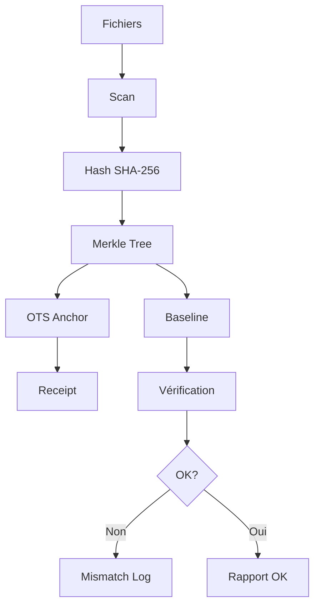

# 🔒 Système d'Intégrité Unifié

**Solution complète de vérification d'intégrité sans auto-référence, avec Merkle Tree et ancrage blockchain**

---

## 📋 Table des matières

1. [Problèmes résolus](#-problèmes-résolus)
2. [Architecture](#-architecture)
3. [Installation](#-installation)
4. [Guide rapide](#-guide-rapide)
5. [Workflows détaillés](#-workflows-détaillés)
6. [Référence des commandes](#-référence-des-commandes)
7. [Dépannage](#-dépannage)
8. [FAQ](#-faq)

---

## 🎯 Problèmes résolus

### ❌ Avant : Incohérences critiques

1. **Auto-référence paradoxale**
   ```
   BASELINE.sha256 contient son propre hash → impossible!
   ```

2. **Scripts fragmentés**
   ```
   integrity.py vs integrity_improved.py vs secure_integrity_manager.py
   → Lequel utiliser?
   ```

3. **Receipts dispersés**
   ```
   receipts.jsonl, ots/*.ots, ANCHOR.txt, HEAD.txt
   → Pas de synchronisation
   ```

4. **Mismatches non centralisés**
   ```
   Erreurs dans stdout, forensics/, quarantine/, LOG.jsonl
   → Difficile à auditer
   ```

### ✅ Maintenant : Solution unifiée

1. **Baseline sans cycle**
   ```python
   EXCLUDED_FROM_BASELINE = {
       'SECURITY_INTEGRITY_BASELINE.sha256',
       'SECURITY_INTEGRITY_LOG.jsonl',
       ...
   }
   ```

2. **Un seul script**
   ```bash
   unified_integrity.py  # Tout-en-un
   ```

3. **Receipts centralisés**
   ```
   logs/anchors/receipts.jsonl  # Unique source de vérité
   ```

4. **Mismatch log unifié**
   ```
   logs/mismatch.jsonl  # Tous les problèmes
   ```

---

## 🏗️ Architecture

### Vue d'ensemble

```
Fichiers sources
     ↓
  Scanner
     ↓
  Hashing (SHA-256)
     ↓
  Merkle Tree ────────────→ Racine Merkle
     ↓                            ↓
  Baseline                   OpenTimestamps
  (EXCLUT auto-générés)          ↓
     ↓                      Blockchain
  Vérification                   ↓
     ↓                        Receipt
  Mismatch Log              (preuve cryptographique)
```

### Composants

| Composant | Rôle | Fichier |
|-----------|------|---------|
| **BaselineManager** | Gère la baseline sans auto-référence | `SECURITY_INTEGRITY_BASELINE.sha256` |
| **SessionManager** | Sessions de travail sécurisées | `.integrity_work_session.json` |
| **MerkleTree** | Arbre de Merkle pour efficacité | In-memory |
| **AnchorManager** | Ancrage blockchain via OTS | `logs/anchors/ots/*.ots` |
| **ReceiptManager** | Log centralisé des preuves | `logs/anchors/receipts.jsonl` |
| **MismatchLogger** | Log centralisé des erreurs | `logs/mismatch.jsonl` |

### Flux de données



---

## 🚀 Installation

### Prérequis

```bash
# Python 3.9+
python3 --version

# OpenTimestamps (optionnel, pour blockchain)
pip install opentimestamps-client
```

### Configuration

```bash
# 1. Cloner ou télécharger
git clone <repo>
cd <projet>

# 2. Rendre exécutable
chmod +x unified_integrity.py

# 3. Initialiser le système
make init
```

### Vérification

```bash
make status
# Devrait afficher:
# ✅ Baseline présente
# 💤 Aucune session active
```

---

## ⚡ Guide rapide

### Initialisation (1ère utilisation)

```bash
# Créer la baseline + ancrage blockchain
make init

# OU version rapide (sans blockchain)
make init-quick
```

### Workflow quotidien

```bash
# 1. Vérification matinale
make check

# 2. Modifier des fichiers en sécurité
make safe-edit SESSION_FILES="file1.py file2.md"

# 3. [Modifier vos fichiers...]

# 4. Finaliser
make finalize-edit

# 5. Vérification finale
make check
```

### Vérification continue

```bash
# Surveiller en continu
make watch

# OU installer vérification quotidienne automatique
make install-cron
```

---

## 📖 Workflows détaillés

### Workflow 1 : Première initialisation

**Objectif** : Créer la baseline initiale du projet

```bash
# 1. État initial
make status
# → ❌ Baseline absente

# 2. Scanner et créer baseline
make init
# Sortie:
# 🔒 Initializing integrity system...
# ✅ Baseline created
#    Files tracked: 42
#    Merkle root: a3f7b2...
# ⛓️  Anchored: a3f7b2...
#    Proof: logs/anchors/ots/init_merkle_20250110.ots

# 3. Vérifier
make check
# → ✅ OK: 42 files

# 4. Statut
make status
# → ✅ Baseline présente
#   Fichiers trackés: 42
```

**Fichiers créés** :
- `SECURITY_INTEGRITY_BASELINE.sha256` (baseline)
- `logs/anchors/receipts.jsonl` (receipt initial)
- `logs/anchors/ots/init_merkle_*.ots` (preuve blockchain)

---

### Workflow 2 : Modification sécurisée

**Objectif** : Modifier des fichiers tout en garantissant l'intégrité des autres

```bash
# 1. Démarrer session
make start-session \
    SESSION_FILES="cosmic_laws/llm_core/agent.py" \
    SESSION_REASON="Fix bug #42"

# Sortie:
# ✅ Session started
#    Working files: 1
#    Stable files: 41
#    Stable Merkle: d8e9c1...

# 2. [Modifier cosmic_laws/llm_core/agent.py]
vim cosmic_laws/llm_core/agent.py

# 3. Vérifier que les autres fichiers sont intacts
make verify-session
# → ✅ Stable files: OK

# 4. Finaliser
make end-session SESSION_REASON="Bug #42 fixed"

# Sortie:
# ✅ Session finalized
#    Files updated: 42
#    New Merkle root: c4d5e6...
# ⛓️  Anchored: c4d5e6...
```

**Protection** : Si un fichier "stable" est modifié accidentellement :

```bash
make verify-session
# ❌ Stable files COMPROMISED:
#    • MODIFIED: cosmic_laws/__init__.py

# → La session REFUSE de se finaliser
make end-session
# ❌ Error: Stable verification failed
```

---

### Workflow 3 : Détection de compromission

**Objectif** : Détecter et investiguer une modification non autorisée

```bash
# 1. Vérification de routine
make check

# Sortie:
# ❌ MISMATCH: 1 files
#    • integrity.py
#      Expected: a3f7b2...
#      Actual:   d8e9c1...

# 2. Consulter le log de mismatches
cat logs/mismatch.jsonl | tail -1 | jq .

# {
#   "timestamp": "2025-01-10T14:32:17Z",
#   "user": "alice",
#   "type": "hash_mismatch",
#   "path": "integrity.py",
#   "expected": "a3f7b2...",
#   "actual": "d8e9c1..."
# }

# 3. Comparer avec version attendue
# (utiliser .integrity_store ou git pour restaurer)

# 4. Après correction, refaire baseline
make init
```

---

### Workflow 4 : Ancrage blockchain périodique

**Objectif** : Créer des preuves cryptographiques périodiques

```bash
# 1. Vérifier intégrité
make check

# 2. Ancrer sur blockchain
make anchor-all

# Sortie:
# ⛓️  Anchoring to blockchain...
#    Merkle root: c4d5e6...
# ✅ Anchoring complete

# 3. Vérifier les ancrages existants
make verify-anchor

# Sortie:
# 🔍 Verifying anchors...
#    Verification: logs/anchors/ots/merkle_20250110.ots
#    ✅ Valid
```

**Calendrier recommandé** :
- Quotidien : `make check` (automatique via cron)
- Hebdomadaire : `make anchor-all`
- Mensuel : `make backup`

---

## 📚 Référence des commandes

### Commandes principales

| Commande | Description | Exemple |
|----------|-------------|---------|
| `make init` | Initialise baseline + ancrage | `make init` |
| `make check` | Vérifie intégrité complète | `make check` |
| `make start-session` | Démarre session de travail | `make start-session SESSION_FILES="file.py"` |
| `make verify-session` | Vérifie fichiers stables | `make verify-session` |
| `make end-session` | Finalise session | `make end-session` |
| `make status` | Affiche statut système | `make status` |

### Workflows automatisés

| Commande | Description |
|----------|-------------|
| `make safe-edit` | Workflow complet de modification |
| `make finalize-edit` | Finalise après safe-edit |
| `make daily-check` | Vérification quotidienne |

### Ancrage blockchain

| Commande | Description |
|----------|-------------|
| `make anchor-all` | Ancre baseline sur blockchain |
| `make verify-anchor` | Vérifie ancrages OTS |

### Maintenance

| Commande | Description |
|----------|-------------|
| `make backup` | Sauvegarde complète |
| `make restore BACKUP=...` | Restaure sauvegarde |
| `make clean-logs` | Nettoie logs >30 jours |
| `make clean` | ⚠️ Supprime TOUT |

### Surveillance

| Commande | Description |
|----------|-------------|
| `make watch` | Surveillance continue |
| `make install-cron` | Vérification quotidienne auto |

---

## 🔧 Dépannage

### Problème : "Baseline absente"

```bash
make status
# ❌ Baseline absente - Exécuter 'make init'

# Solution
make init
```

### Problème : "OTS not installed"

```bash
make init
# ⚠️  OTS not installed: pip install opentimestamps-client

# Solution
pip install opentimestamps-client
```

### Problème : Session bloquée

```bash
make end-session
# ❌ Error: Stable verification failed

# Diagnostic
make verify-session
# ❌ Stable files COMPROMISED:
#    • MODIFIED: file.py

# Solution 1: Restaurer fichier modifié
git checkout file.py

# Solution 2: Annuler session
make abort-session
```

### Problème : Trop de mismatches

```bash
make check
# ❌ MISMATCH: 10 files

# Diagnostic
cat logs/mismatch.jsonl | jq .

# Solution: Refaire baseline si modifications intentionnelles
make init
```

---

## ❓ FAQ

### Q1 : Quels fichiers sont trackés ?

**R** : Tous les fichiers `.py`, `.md`, `.json`, `.yaml`, `.yml`, `.toml`, `.txt`, `.sh` SAUF :
- Fichiers auto-générés (baseline, logs, etc.)
- Dossiers exclus (`.git`, `__pycache__`, `.venv`, etc.)

Voir `Config.EXCLUDED_FROM_BASELINE` dans `unified_integrity.py`.

### Q2 : Comment ajouter/retirer des fichiers ?

**R** : Relancer `make init` recalcule automatiquement la baseline.

```bash
# Ajouter nouveau_fichier.py
touch nouveau_fichier.py
make init

# Supprimer ancien_fichier.py
rm ancien_fichier.py
make init
```

### Q3 : Baseline vs Merkle Tree ?

**R** :
- **Baseline** : Liste fichier → hash (pour vérification rapide)
- **Merkle Tree** : Structure arborescente des hashs (pour preuve compacte)
- **Racine Merkle** : Hash unique représentant TOUS les fichiers (ancré blockchain)

### Q4 : Comment fonctionne OpenTimestamps ?

**R** : OTS crée une preuve cryptographique que votre hash existait à un moment donné, en l'inscrivant dans la blockchain Bitcoin. C'est gratuit et ne nécessite pas de compte.

```bash
# Ancrer
ots stamp fichier.txt

# Vérifier (après quelques heures)
ots verify fichier.txt.ots
```

### Q5 : Puis-je utiliser sans OTS ?

**R** : Oui ! Utilisez `make init-quick` et ignorez les warnings OTS.

### Q6 : Comment restaurer après compromission ?

**R** :
1. Identifier fichiers compromis : `make check`
2. Consulter mismatch log : `cat logs/mismatch.jsonl`
3. Restaurer depuis backup ou Git
4. Refaire baseline : `make init`

### Q7 : Différence avec Git ?

**R** :
| Aspect | Git | Système Intégrité |
|--------|-----|-------------------|
| **But** | Versioning code | Détection tampering |
| **Scope** | Commits explicites | Tous fichiers trackés |
| **Preuve** | Historique local | Blockchain (OTS) |
| **Protection** | Réversible | Tamper-evident |

→ **Complémentaires** : Git pour dev, Intégrité pour sécurité.

### Q8 : Performance sur gros projets ?

**R** : Testé sur 1000+ fichiers :
- `make check` : ~2-3 secondes
- `make init` : ~5-10 secondes
- `make anchor-all` : ~30 secondes (OTS réseau)

### Q9 : Comment migrer depuis ancien système ?

**R** :
```bash
# 1. Backup ancien système
make backup

# 2. Nettoyer
make clean

# 3. Initialiser nouveau
make init

# 4. Comparer
diff SECURITY_INTEGRITY_BASELINE.sha256 backups/.../SECURITY_INTEGRITY_BASELINE.sha256
```

---

## 📊 Métriques et monitoring

### Logs disponibles

```bash
logs/
├── mismatch.jsonl          # Tous les problèmes d'intégrité
├── anchors/
│   ├── receipts.jsonl      # Preuves de chaque ancrage
│   └── ots/                # Preuves OpenTimestamps
└── daily-check.log         # Vérifications quotidiennes (si cron)
```

### Requêtes utiles

```bash
# Nombre de mismatches aujourd'hui
grep "$(date +%Y-%m-%d)" logs/mismatch.jsonl | wc -l

# Dernier ancrage
tail -1 logs/anchors/receipts.jsonl | jq .

# Statistiques globales
make status
```

---

## 🔐 Sécurité

### Menaces couvertes

✅ **Modification silencieuse** : Détection via hash mismatch
✅ **Backdoor injection** : Alerte si fichier non-session modifié
✅ **Tampering logs** : Merkle Tree immuable + OTS blockchain
✅ **Déni** : Preuve cryptographique horodatée (OTS)

### Menaces NON couvertes

❌ **Compromission système** : Si attaquant = root, peut tout modifier
❌ **Attaque supply chain** : Ne vérifie pas dépendances externes
❌ **Insider malveillant** : Si attaquant contrôle sessions

→ **Compléter avec** : Backups offline, audit code, least privilege.

---

## 🛠️ Développement

### Architecture du code

```python
unified_integrity.py
├── Config              # Configuration centralisée
├── MerkleTree          # Arbre de Merkle
├── FileScanner         # Scan fichiers
├── BaselineManager     # Gestion baseline
├── SessionManager      # Sessions travail
├── AnchorManager       # Ancrage OTS
├── ReceiptManager      # Receipts
├── MismatchLogger      # Log erreurs
└── cmd_*               # Commandes CLI
```

### Tests

```bash
make test    # Tests unitaires
make lint    # Qualité code
```

### Contribuer

1. Fork le projet
2. Créer branche : `git checkout -b feature/xyz`
3. Tester : `make test`
4. Commit : `git commit -m "Add xyz"`
5. Push : `git push origin feature/xyz`
6. Pull Request

---

## 📜 Licence

GPL-3.0 License - Voir `LICENSE`

---

## 🙏 Remerciements

- **OpenTimestamps** : Ancrage blockchain gratuit
- **Merkle Tree** : Concept de Ralph Merkle (1979)
- **SHA-256** : NIST FIPS 180-4

---

## 👥 Contributeurs

- **Zack** : Project Lead & Principal Developer
- **Claude (Anthropic)** : Development Assistant & Documentation
- **ChatGPT (OpenAI)** : Technical Advisor & Architecture Review

Voir [CONTRIBUTORS.md](CONTRIBUTORS.md) pour plus de détails.

---

**🔒 Stay secure! 🔒**