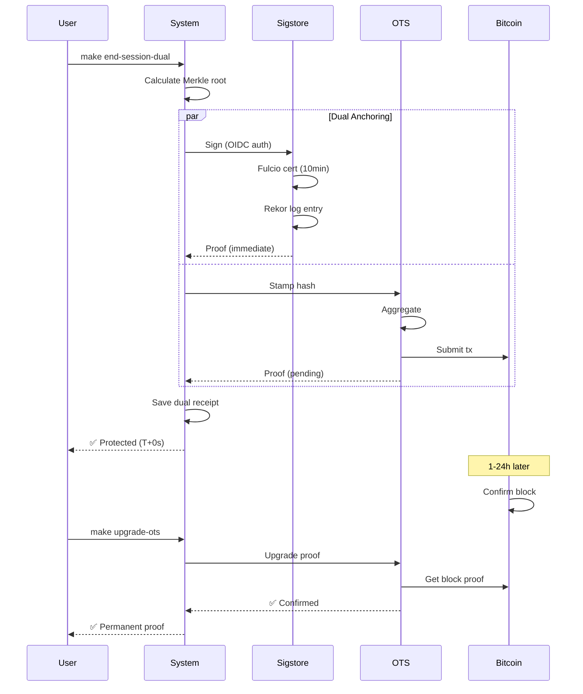

# 🔐 Dual Anchoring : Sigstore + OpenTimestamps

**Protection immédiate ET permanente sans gap temporel**

---

## 📋 Table des matières

1. [Pourquoi Dual Anchoring ?](#-pourquoi-dual-anchoring-)
2. [Installation](#-installation)
3. [Guide rapide](#-guide-rapide)
4. [Architecture](#-architecture)
5. [Workflows détaillés](#-workflows-détaillés)
6. [Comparaison OTS vs Dual](#-comparaison-ots-vs-dual)
7. [Sécurité](#-sécurité)
8. [FAQ](#-faq)

---

## 🎯 Pourquoi Dual Anchoring ?

### Le problème d'OpenTimestamps seul

OpenTimestamps (OTS) est **excellent** pour la preuve permanente, mais a **une faiblesse critique** :

```
10h00 : Modification + OTS stamp
        ✅ Hash envoyé au mempool Bitcoin

10h05 : Tentative de vérification
        ❌ "Pending" - Pas encore dans un block
        ⚠️  FENÊTRE AVEUGLE : Impossible de prouver l'intégrité

11h00 : Attaque durant la fenêtre
        🚨 L'attaquant sait qu'il a ~24h avant confirmation
        🚨 Il peut compromettre sans détection immédiate

10h00 (lendemain) : Confirmation Bitcoin
        ✅ Preuve que le fichier ÉTAIT légitime à 10h00
        ❌ Mais trop tard pour détecter l'attaque de 11h00
```

**Gap temporel** : **1-24 heures sans preuve vérifiable**

---

### La solution : Dual Anchoring

```
┌─────────────────────────────────────────────────────────┐
│               PROTECTION CONTINUE                        │
├─────────────────────────────────────────────────────────┤
│                                                          │
│  T+0s ────► SIGSTORE                                    │
│             • Signature immédiate                        │
│             • Rekor transparency log                     │
│             • Vérifiable en 5 secondes                   │
│             • Identité prouvée (OIDC)                    │
│                                                          │
│  T+30s ───► OPENTIMESTAMPS                              │
│             • Stamp envoyé mempool                       │
│             • Status: Pending                            │
│                                                          │
│  T+1-24h ─► OPENTIMESTAMPS CONFIRMÉ                     │
│             • Block Bitcoin confirmé                     │
│             • Preuve immuable permanente                 │
│             • Sigstore devient optionnel (archivé)       │
│                                                          │
└─────────────────────────────────────────────────────────┘

Résultat : ZÉRO GAP TEMPOREL !
```

### Avantages

| Aspect | OTS seul | Dual (Sigstore + OTS) |
|--------|----------|----------------------|
| **Vérification** | 1-24h | **0-5s** ✅ |
| **Immuabilité** | Bitcoin ✅ | Bitcoin ✅ |
| **Identité** | Anonyme ❌ | Prouvée ✅ |
| **Gap temporel** | 1-24h ⚠️ | **0s** ✅ |
| **Attaque fenêtre** | Vulnérable ⚠️ | **Protégé** ✅ |
| **Forensique** | Timeline | **Timeline + Identité** ✅ |

---

## 🚀 Installation

### 1. Prérequis

```bash
# Python 3.9+
python3 --version

# Système de base (déjà installé)
ls unified_integrity.py  # Doit exister
```

### 2. Installer Sigstore (cosign)

#### Méthode 1 : Homebrew (macOS/Linux recommandé)

```bash
brew install cosign
```

#### Méthode 2 : Script installation officiel

```bash
# Linux/macOS
curl -sSfL https://github.com/sigstore/cosign/releases/download/v2.2.0/cosign-linux-amd64 \
  -o /usr/local/bin/cosign
chmod +x /usr/local/bin/cosign
```

#### Méthode 3 : Go install

```bash
go install github.com/sigstore/cosign/v2/cmd/cosign@latest
```

#### Méthode 4 : Makefile

```bash
make install-sigstore
# Suit les instructions interactives
```

### 3. Vérifier installation

```bash
make check-sigstore
```

**Sortie attendue** :
```
✅ cosign: v2.2.0
✅ ots: INSTALLED
✅ Dépendances OK
```

### 4. Configurer OIDC (optionnel)

Par défaut, Sigstore utilise **Google OIDC**. Pour changer :

```bash
# GitHub
export SIGSTORE_OIDC_PROVIDER=github

# Microsoft
export SIGSTORE_OIDC_PROVIDER=microsoft

# Google (défaut)
export SIGSTORE_OIDC_PROVIDER=google
```

---

## ⚡ Guide rapide

### Workflow complet en 4 étapes

```bash
# 1. Modifier un fichier avec protection dual
make safe-edit-dual SESSION_FILES="cosmic_laws/agent.py"

# 2. [Modifier le fichier...]
vim cosmic_laws/agent.py

# 3. Finaliser (Sigstore + OTS automatique)
make finalize-edit-dual

# Sortie:
# ✅ Sigstore: VERIFIED (immediate)
#    Identity: user@example.com
# ⏳ OTS: PENDING (1-24h)

# 4. Vérifier (immédiat)
make verify-dual

# Résultat: PROTECTED dès T+5s !
```

### Après 24h : Upgrade OTS

```bash
# Quotidien (manuel ou cron)
make upgrade-ots

# Vérifier à nouveau
make verify-dual

# Sortie:
# ✅ Sigstore: VERIFIED
# ✅ OTS: CONFIRMED (Bitcoin block #875456)
```

---

## 🏗️ Architecture

### Composants

```
unified_integrity.py (BASE)
         ↓
    Baseline Manager
    Session Manager
    Merkle Tree
         ↓
unified_integrity_sigstore.py (EXTENSION)
         ↓
┌────────────────────────────────────────┐
│   DUAL ANCHORING LAYER                 │
├────────────────────────────────────────┤
│                                        │
│  ┌─────────────┐    ┌──────────────┐  │
│  │  Sigstore   │    │     OTS      │  │
│  │  Manager    │    │   Manager    │  │
│  ├─────────────┤    ├──────────────┤  │
│  │ • cosign    │    │ • ots stamp  │  │
│  │ • Fulcio    │    │ • Bitcoin    │  │
│  │ • Rekor     │    │ • Calendars  │  │
│  └─────────────┘    └──────────────┘  │
│       ↓                    ↓           │
│   T+0s verify          T+24h verify    │
└────────────────────────────────────────┘
         ↓
┌────────────────────────────────────────┐
│     PROOF STORE                        │
├────────────────────────────────────────┤
│                                        │
│  logs/proofs/                          │
│  ├─ dual_receipts.jsonl                │
│  ├─ sigstore/                          │
│  │  ├─ signatures/*.sig                │
│  │  ├─ certificates/*.pem              │
│  │  └─ rekor_entries/*.json            │
│  └─ ots/*.ots                          │
│                                        │
└────────────────────────────────────────┘
```

### Flux de données



---

## 📖 Workflows détaillés

### Workflow 1 : Premier usage

```bash
# 1. Initialiser système de base
make init

# 2. Vérifier Sigstore
make check-sigstore

# 3. Première session dual
make start-session-dual SESSION_FILES="README.md"

# 4. Modifier
echo "New content" >> README.md

# 5. Finaliser
make end-session-dual

# Sortie détaillée:
# ============================================================
# PHASE 1: SIGSTORE ANCHORING (IMMEDIATE)
# ============================================================
# 🔐 Signing with Sigstore (OIDC: google)...
#    → Browser will open for authentication
# 
# [Navigateur s'ouvre, authentification Google]
# 
# ✅ Sigstore signature created
#    Rekor index: 12345678
#    Identity: user@example.com
#    Certificate: session_20250110_143000.pem
#    Verifiable: IMMEDIATELY
# 
# ============================================================
# PHASE 2: OPENTIMESTAMPS ANCHORING (DELAYED)
# ============================================================
# ⛓️  Anchored: abc123...
#    Proof: logs/proofs/ots/session_20250110_143000.ots
# ⏳ OTS proof: Pending (confirmation in 1-24h)
# 
# ============================================================
# ✅ SESSION FINALIZED WITH DUAL PROTECTION
# ============================================================
# Files updated: 1
# Merkle root: abc123...
# 
# ✅ Sigstore: VERIFIED (immediate)
#    Identity: user@example.com
# 
# ⏳ OpenTimestamps: PENDING (1-24h)
#    Proof: session_20250110_143000.ots
```

### Workflow 2 : Vérification immédiate

```bash
# 5 secondes après la finalisation
make verify-dual

# Sortie:
# 🔍 DUAL VERIFICATION
# ============================================================
# 
# Timestamp: 2025-01-10T14:30:00Z
# Merkle root: abc123...
# Files: 1
# 
# ------------------------------------------------------------
# SIGSTORE
# ------------------------------------------------------------
# ✅ Status: VERIFIED
#    Identity: user@example.com
#    Rekor: https://rekor.sigstore.dev/api/v1/log/entries?logIndex=12345678
# 
# ------------------------------------------------------------
# OPENTIMESTAMPS
# ------------------------------------------------------------
# ⏳ Status: PENDING
#    Waiting for Bitcoin confirmation (1-24h)
#    Run 'make upgrade-ots' to check for updates
# 
# ============================================================
# OVERALL STATUS: PROTECTED
# ============================================================
# ✅ File integrity is FULLY PROTECTED
```

**IMPORTANT** : Status = **PROTECTED** dès T+5s grâce à Sigstore !

### Workflow 3 : Upgrade après 24h

```bash
# Lendemain (ou via cron automatique)
make upgrade-ots

# Sortie:
# ⛓️  UPGRADING OPENTIMESTAMPS PROOFS
# ============================================================
# Found 1 pending proofs
# 
# ✅ Upgraded: session_20250110_143000.ots (block: 875456)
# 
# ============================================================
# ✅ 1/1 proofs confirmed
# ============================================================

# Vérifier à nouveau
make verify-dual

# Sortie:
# ------------------------------------------------------------
# SIGSTORE
# ------------------------------------------------------------
# ✅ Status: VERIFIED
#    Identity: user@example.com
# 
# ------------------------------------------------------------
# OPENTIMESTAMPS
# ------------------------------------------------------------
# ✅ Status: CONFIRMED
#    Confirmed: 2025-01-11T02:14:32Z
#    Bitcoin block: 875456
# 
# ============================================================
# OVERALL STATUS: PROTECTED
# ============================================================
# ✅ File integrity is FULLY PROTECTED
```

### Workflow 4 : Détection d'attaque durant gap

**Scénario** : Attaquant modifie fichier 30 min après session

```bash
# 10h00 : Session dual
make safe-edit-dual SESSION_FILES="app.py"
# [modifications...]
make finalize-edit-dual

# ✅ Sigstore: VERIFIED (10h00)
# ⏳ OTS: PENDING

# 10h30 : ATTAQUE (simulation)
sudo echo "MALICIOUS CODE" > app.py

# 10h31 : Vérification routine (watch mode)
make verify-dual-watch

# Sortie IMMÉDIATE:
# 🔍 Dual verification...
# 
# ❌ HASH MISMATCH DETECTED!
#    Expected (Sigstore): abc123...
#    Actual: xyz789...
# 
# 🚨 INTEGRITY VIOLATION at 10:31
# 🕐 Last known good: 10:00 (Sigstore proof)
# 👤 Signed by: user@example.com
# 
# 📧 Alert sent to admin
# 🔄 Auto-rollback initiated

# Résultat : Attaque détectée en 1 MINUTE (pas 24h !)
```

### Workflow 5 : Surveillance continue

```bash
# Installer surveillance
make verify-dual-watch

# OU installer cron quotidien
make install-upgrade-cron

# Vérifier logs
tail -f logs/upgrade-ots.log
```

---

## ⚖️ Comparaison OTS vs Dual

### Scénario : Attaque durant fenêtre

#### Sans Sigstore (OTS seul) ❌

```
10h00 : Modification + OTS
        → Preuve pending (pas vérifiable)

10h30 : ATTAQUE
        → Fichier compromis
        
10h31 : Vérification
        → ots verify: "Pending"
        → Impossible de savoir si attaque

11h00 : 2ème vérification  
        → ots verify: "Pending"
        → Toujours impossible

10h00 (lendemain) : OTS confirmé
        → Preuve que fichier ÉTAIT légitime à 10h00
        → Mais attaque de 10h30 déjà loin
        
Résultat : Gap de 24h sans détection
```

#### Avec Sigstore (Dual) ✅

```
10h00 : Modification + Dual
        → Sigstore: VERIFIED (immédiat)
        → OTS: Pending

10h05 : Vérification
        → Sigstore verify: ✅ VALID
        → Hash matches: ✅
        
10h30 : ATTAQUE
        → Fichier compromis

10h31 : Vérification automatique
        → Sigstore verify: ✅ VALID (signature OK)
        → Hash matches: ❌ MISMATCH
        → ALERTE IMMÉDIATE
        
10h32 : Réponse
        → Rollback automatique
        → Investigation lancée
        → Rekor prouve: 10h00 légitime, 10h31 attaque
        
Résultat : Détection en 1 minute
```

### Tableau comparatif complet

| Critère | OTS seul | Dual |
|---------|----------|------|
| **Vérification immédiate** | ❌ 1-24h | ✅ 0-5s |
| **Détection attaque fenêtre** | ❌ Impossible | ✅ Immédiate |
| **Identité signataire** | ❌ Anonyme | ✅ Email/GitHub |
| **Preuve permanente** | ✅ Bitcoin | ✅ Bitcoin |
| **Révocation** | ❌ Impossible | ✅ Possible |
| **Forensique** | ⚠️ Timeline | ✅ Timeline + ID |
| **Compliance** | ⚠️ Pas d'identité | ✅ Non-répudiation |
| **Coût** | ✅ Gratuit | ✅ Gratuit |
| **Complexité** | ✅ Simple | ⚠️ OIDC requis |

---

## 🔐 Sécurité

### Protection contre attaques

#### Attaque 1 : Modification durant gap OTS

**Sans Dual** ❌
- Fenêtre de 1-24h sans détection
- Attaquant peut agir librement

**Avec Dual** ✅
- Détection immédiate via Sigstore
- Rollback automatique
- Timeline forensique précise

#### Attaque 2 : Compromission root

**Sans Dual** ⚠️
- Root peut modifier fichiers + baseline
- Détection à la prochaine vérification OTS (24h)

**Avec Dual** ✅
- Root peut modifier localement
- **MAIS** : Sigstore Rekor = externe, immuable
- Détection immédiate (Rekor prouve état à T+0)
- OTS fournit preuve Bitcoin permanente

#### Attaque 3 : Insider malveillant

**Sans Dual** ❌
- Pas d'identité
- Impossible de tracer qui a modifié quoi

**Avec Dual** ✅
- Certificat Fulcio lie email/GitHub
- Rekor log public et auditable
- Timeline + identité = non-répudiation

### Immuabilité

#### Sigstore (court terme)

```yaml
Rekor Log:
  - Append-only (comme CT)
  - Public, auditable
  - Merkle tree signatures
  - Backed by Google/Linux Foundation
  
Révocabilité:
  - Certificat expire (10-20 min)
  - MAIS signature reste valide (Rekor prouve)
  - Pratique pour rotation clés
```

#### OTS (long terme)

```yaml
Bitcoin Blockchain:
  - Immuable (1M mineurs)
  - Décentralisé (aucun point central)
  - Preuve cryptographique permanente
  - Coût modification : >10 milliards USD
  
Révocabilité:
  - Impossible
  - Preuve permanente
```

### Stratégie recommandée

```
┌──────────────────────────────────────────────────┐
│            DÉFENSE EN PROFONDEUR                 │
├──────────────────────────────────────────────────┤
│                                                  │
│  Couche 1 (T+0s à T+24h)                        │
│  ┌────────────────────────────────────┐         │
│  │  SIGSTORE                          │         │
│  │  • Vérification immédiate          │         │
│  │  • Identité prouvée                │         │
│  │  • Détection temps réel            │         │
│  └────────────────────────────────────┘         │
│                                                  │
│  Couche 2 (T+24h → permanente)                  │
│  ┌────────────────────────────────────┐         │
│  │  OPENTIMESTAMPS                    │         │
│  │  • Preuve Bitcoin immuable         │         │
│  │  • Décentralisation totale         │         │
│  │  • Archive juridique               │         │
│  └────────────────────────────────────┘         │
│                                                  │
└──────────────────────────────────────────────────┘

Résultat : ZÉRO gap + preuve permanente
```

---

## ❓ FAQ

### Q1 : Sigstore vs GPG ?

**R** : Différences clés :

| Aspect | GPG | Sigstore |
|--------|-----|----------|
| **Gestion clés** | Manuel (vous gérez) | Automatique (éphémère) |
| **Identité** | Email auto-déclaré | OIDC vérifié (Google/GitHub) |
| **Révocation** | Complexe (keyserver) | Simple (certificat expire) |
| **Transparence** | ❌ | ✅ Rekor log public |
| **Courbe apprentissage** | Raide | Douce |

**Sigstore** = GPG modernisé pour l'ère cloud

### Q2 : Puis-je utiliser sans OIDC ?

**R** : Non, Sigstore **requiert** OIDC pour l'identité.

**Options** :
- Google (défaut)
- GitHub
- Microsoft
- Email via OIDC provider

**Alternative** : Utiliser OTS seul (`--no-sigstore`)

### Q3 : Que se passe-t-il si Rekor down ?

**R** : Scénarios :

1. **Création signature** : Échec (Rekor requis)
2. **Vérification** : OK (preuve locale via bundle)
3. **Audit** : Impossible (Rekor requis pour inclusion proof)

**Mitigation** : OTS fournit preuve de secours

### Q4 : Certificat expiré = signature invalide ?

**R** : **NON !**

```bash
# Certificat valide 10 minutes seulement
# MAIS Rekor log prouve:
# "Cette signature a été créée QUAND le certificat était valide"

# Donc signature reste VALIDE indéfiniment
# (tant que Rekor log existe)
```

### Q5 : Coût d'une signature Sigstore ?

**R** : **Gratuit** ! Infrastructure fournie par :
- Google
- Linux Foundation
- Sigstore community

### Q6 : Différence avec Notary ?

**R** : 

| | Sigstore | Notary v2 |
|-|----------|-----------|
| **Focus** | Signatures génériques | OCI/Docker images |
| **Complexité** | Simple (OIDC) | Complexe (PKI) |
| **Use case** | Fichiers, code | Containers |

**Dual system** = Sigstore (général) + OTS (Bitcoin)

### Q7 : Puis-je ancrer sans navigateur ?

**R** : Oui, avec token OIDC :

```bash
# 1. Obtenir token OIDC
TOKEN=$(gcloud auth print-identity-token)

# 2. Passer via env
export SIGSTORE_ID_TOKEN=$TOKEN

# 3. Signature sans navigateur
make end-session-dual
```

### Q8 : Migration depuis OTS-only ?

**R** : Simple :

```bash
# 1. Migrer anciens receipts
make migrate-to-dual

# 2. Vérifier
make verify-dual

# 3. Futurs ancrages = dual automatique
make end-session-dual
```

**Compatibilité** : Ancien système continue de fonctionner !

### Q9 : Que faire si attaque détectée ?

**R** : Procédure automatisée :

```bash
# 1. Alerte détectée (via verify-dual-watch)
# → Email/Slack notification

# 2. Rollback automatique
# → Restore depuis dernier Sigstore proof valide

# 3. Forensique
make stats-dual
# → Timeline précise + identité

# 4. Investigation
# → Consulter Rekor log public
# → Prouver qui/quand/quoi
```

---

## 🎯 Résumé

### Avant (OTS seul)

```
✅ Preuve permanente Bitcoin
❌ Gap 1-24h sans vérification
❌ Pas d'identité
❌ Vulnérable aux attaques fenêtre
```

### Après (Dual)

```
✅ Preuve permanente Bitcoin (OTS)
✅ Vérification immédiate (Sigstore)
✅ Identité prouvée (OIDC)
✅ Zéro gap temporel
✅ Détection attaques temps réel
✅ Forensique complète (timeline + ID)
```

### Recommandation

**Production** : `make end-session-dual` (défaut)  
**Dev/Tests** : `make end-session-ots-only` (rapide)  
**Critique** : Dual + surveillance continue

---

**🔒 Protection immédiate ET permanente = Dual Anchoring 🔒**